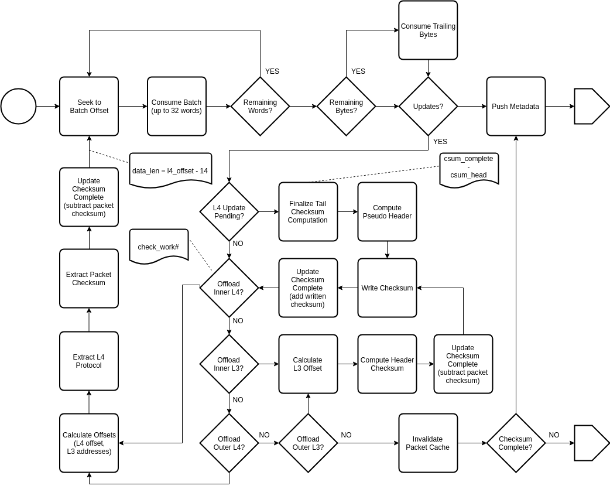

.. Copyright (c) 2018-2019 Netronome Systems, Inc. All rights reserved.
   SPDX-License-Identifier: BSD-2-Clause

Action - CHECKSUM 
=================

Description
-----------

Interface and Encoding
----------------------
.. rst-class:: action-encoding
    
    +------+-+-+-+-+-+-+-+-+-+-+-+-+-+-+-+-+-+-+-+-+-+-+-+-+-+-+-+-+-+-+-+-+
    |Bit / |3|3|3|2|2|2|2|2|2|2|2|2|2|1|1|1|1|1|1|1|1|1|1|0|0|0|0|0|0|0|0|0|
    |Word  |1|0|9|8|7|6|5|4|3|2|1|0|9|8|7|6|5|4|3|2|1|0|9|8|7|6|5|4|3|2|1|0|
    +======+=+=+=+=+=+=+=+=+=+=+=+=+=+=+=+=+=+=+=+=+=+=+=+=+=+=+=+=+=+=+=+=+
    |   0  |            <addr>           |P|      0      |M|   0   |I|i|C|c|
    +------+-----------------------------+-+-------------+-+-------+-+-+-+-+

:M: Update CHECKSUM_COMPLETE metadata
:I: Update inner L3 checksum in packet (if requested by host)
:i: Update inner L4 checksum in packet (if requested by host)
:C: Update outer L3 checksum in packet (if requested by host)
:c: Update outer L4 checksum in packet (if requested by host)

Reads
.....

- PKT_DATA
- PV_CBS
- PV_CSUM_OFFLOAD
- PV_CTM_ADDR
- PV_CTM_ALLOCATED
- PV_HEADER_STACK
- PV_LENGTH
- PV_MU_ADDR
- PV_OFFSET
- PV_PROTO

Writes
......

- PKT_DATA
- PV_META

Implementation
--------------

API Dependencies
................

- __actions_next()
- __actions_read()
- __actions_restore_t_idx()
- bitfield_extract()
- pv_get_length()
- pv_invalidate_cache()
- pv_seek()
- pv_meta_push_type()
