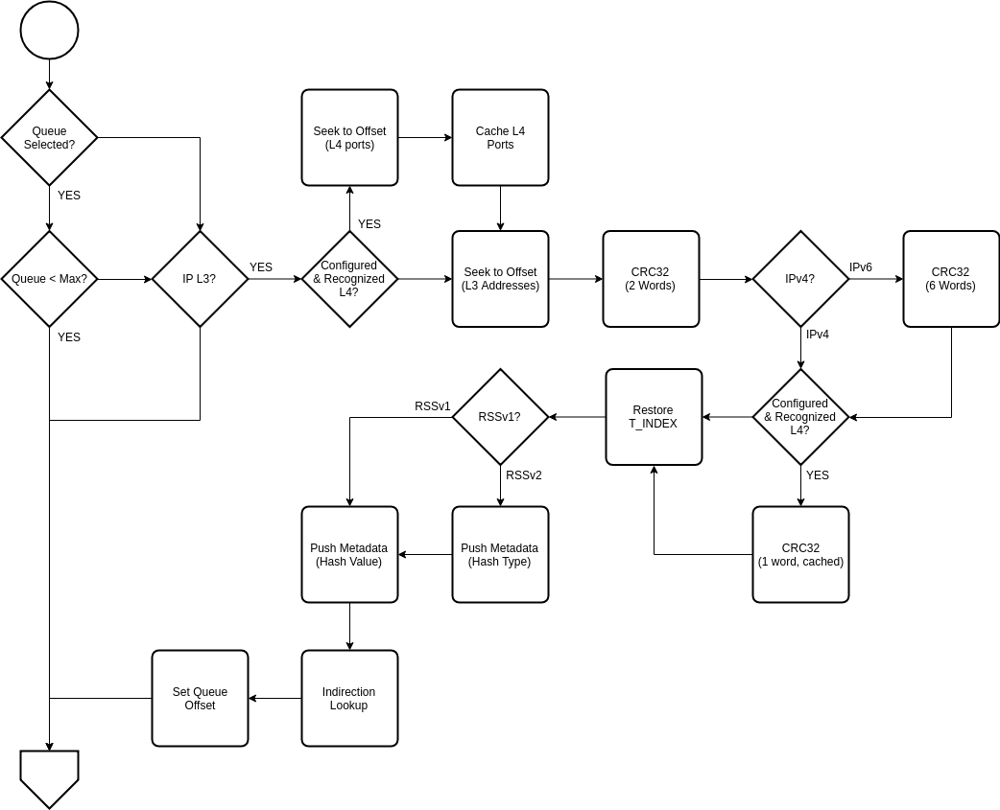

.. Copyright (c) 2018-2019 Netronome Systems, Inc. All rights reserved.
   SPDX-License-Identifier: BSD-2-Clause

Action - RSS
============

Description
-----------

The RSS action determines a queue offset relative to a VNIC base queue by means of
a CRC-32 based hash of selected packet headers. This resulting hash value is used
to perform a lookup in the supplied indirection table to render the final sub-queue
index, with the ultimate purpose of load balancing packets with flow affinity to
VNIC queues in accordance with the distribution provided by the indirection table.

If packets are subsequently sent to the host using the :doc:`TX_HOST <tx_host>`
action, then the queue offset provided by this action is added to the base
transmit queue to determine the absolute queue number used for transmission
over PCIe. The calculated hash value is also added to the packet prepend
metadata that is passed to the host.

Interface and Encoding
----------------------
.. rst-class:: action-encoding
    
    +------+-+-+-+-+-+-+-+-+-+-+-+-+-+-+-+-+-+-+-+-+-+-+-+-+-+-+-+-+-+-+-+-+
    |Bit / |3|3|2|2|2|2|2|2|2|2|2|2|1|1|1|1|1|1|1|1|1|1|0|0|0|0|0|0|0|0|0|0|
    |Word  |1|0|9|8|7|6|5|4|3|2|1|0|9|8|7|6|5|4|3|2|1|0|9|8|7|6|5|4|3|2|1|0|
    +======+=+=+=+=+=+=+=+=+=+=+=+=+=+=+=+=+=+=+=+=+=+=+=+=+=+=+=+=+=+=+=+=+
    |   0  |            <addr>           |P|u|t|U|T| |tidx|  |1| Max Queue |
    +------+---------------+-------------+-+-+-+-+-+---------+-+-+---------+
    |   1  |                            RSS Key                            |
    +------+---------------------------------------------------------------+
 
    .. |tidx| replace:: Table Index

:u: Enable RSS for IPv4 UDP packets 
:t: Enable RSS for IPv4 TCP packets
:U: Enable RSS for IPv6 UDP packets
:T: Enable RSS for IPv6 TCP packets
:1: Enable legacy RSSv1 prepend metadata protocol
:|tidx|: Index identifying the redirection table to use
:Max Queue: The maximum allowed queue offset
:RSS Key: Initial residual for the CRC hash

The RSS action supports the Internet Protocol (IP) and will unconditionally hash
over L3 provided that the packet header is recognized as IP. In this regard, the 
implementation consults the inner IP header in the presence of a recognized tunnel
encapsulation [#]_. The associated L4 behavior is configurable, with options to
include UDP or TCP port information (if present in the packet) into the hash,
independently selectable for both IPv4 and IPv6 packets.

Two prepend metadata protocols are supported. The legacy ABI, associated with the
RSS capability, supports only an RSS hash and so does not include a metadata type
to distinguish the hash from other prepend metadata elements. Using the legacy
RSSv1 ABI precludes the simultaneous use of other metadata fields, such as the
checksum complete information provided by the :doc:`CHECKSUM <checksum>` action.
Whereas the improved ABI, associated with the RSS2 and CSUM_COMPLETE capabilities,
includes additional type information that enables the coexistence of multiple
elements of metadata. The action can be configured for legacy behavior to support
RSS on older drivers that do not know how to interpret this type information.

To support multiple independent VNICs the encoding supports selecting the
redirection table utilized by the implementation. This indirection table is
typically programmed by the host via the configuration plane on a per VNIC
basis. The action encoding allocates 5 bits - allowing for up to 32 independent
indirection tables (stored in CLS memory) to be configured. Each table consists
of 128 8-bit entries, with each entry interpreted as an offset from the base
queue allocated to the VNIC. Given an evenly distributed hash as a selector
into the table, the redirection table can be utilized to weight certain queues
more heavily than others, or even remove queues entirely from selection by
exclusion.

The max queue parameter is used in conjunction with the queue selected bit in
the packet vector to support programmable RSS. An offloaded eBPF program, if
executed before the RSS action, may choose to set the final queue offset
programmatically. In such cases, the eBPF program also sets the PV_QUEUE_SELECTED
bit in the packet vector to indicate that the standard RSS logic should be
skipped. The queue offset provided by the eBPF program is not trusted and must
be verified at runtime against the maximum queue offset allowed for the VNIC.
If the provided offset exceeds the maximum allowed queue then normal RSS
processing is performed. Note that max queue is not used to verify queue
offsets in the RSS indirection table - the configuration plane is responsible
for ensuring validity of the entries outside of the fast path.

Reads
.....

- PKT_DATA
- PV_PROTO
- PV_HEADER_OFFSET_INNER_IP
- PV_HEADER_OFFSET_INNER_L4
- PV_QUEUE_SELECTED

Writes
......

- CRC_REMAINDER
- PV_META_TYPES
- PV_PREPEND_METADATA
- PV_QUEUE_OFFSET

Implementation
--------------

The RSS implementation leverages the CRC unit embedded in each NFP microengine. All microengine
threads share a single instance of the CRC hardware as well as the corresponding input and output
CSR, namely CRC_REMAINDER. Care must thus be taken to either save and restore CRC state over
potential context swaps (as may be required to read packet data into the microengine) [#]_ or the
data must first be gathered into local registers in its entirety before the CRC hardware is invoked,
such that the whole CRC operation can be performed without swapping threads. Given that retrieving
and restoring CRC state would cost 8 cycles [#]_, the implementation employs the latter strategy to
advantageous effect and, since the source and destination L4 ports fit within a single register,
it makes sense to incur the possible context swap required to read and cache the L4 fields of
interest for later use before potentially swapping to read the longer IP address data.

Before expending the effort required to process the above-mentioned CRC, it is worth determining
whether the hash 

API Dependencies
................

- __actions_next()
- __actions_read_begin()
- __actions_read()
- __actions_read_end()
- __actions_restore_t_idx()
- bitfield_extract()
- pv_seek()
- pv_set_queue_offset()
- pv_meta_push_type()

.. [#] The presence of an IP layer 3 header is ascertained by consulting the packet vector's
       inner IP offset field. This field is computed by the datapath's underlying header parse
       logic during packet reception. A non-zero value indicates the offset of the innermost IP
       header over supported encapsulations (up to the maximal parse depth), with a zero value
       indicating that no IP header was recognized. In the event that the outer IP header is the
       innermost recognized IP header (ie. where there is no recognized encapsulation) then the
       inner IP offset is set equal to the outer IP offset. Thus, the RSS action need only concern
       itself with PV_HEADER_OFFSET_INNER_IP.

.. [#] Performing a single context swap to simultaneously read both L3 and L4 data from the
       packet would also be possible, however, doing so would bypass the packet cache provided
       by the pv_seek() API. This API is T_INDEX based and can thus only return a pointer to a
       single datum for a given call (which might swap). The callee cannot rely on all the data
       necessarily being resident in the cache (which wouldn't require a swap).

.. [#] 5 cycles to cover the read latency for CRC_REMAINDER after the latest update and 2 cycles
       for the corresponding local_csr_rd[] plus an additional cycle for the local_csr_wr[] that
       is required reload the state. Given the surrounding implementation, it is not possible to
       fill the 5 cycle read latency with other productive work.
