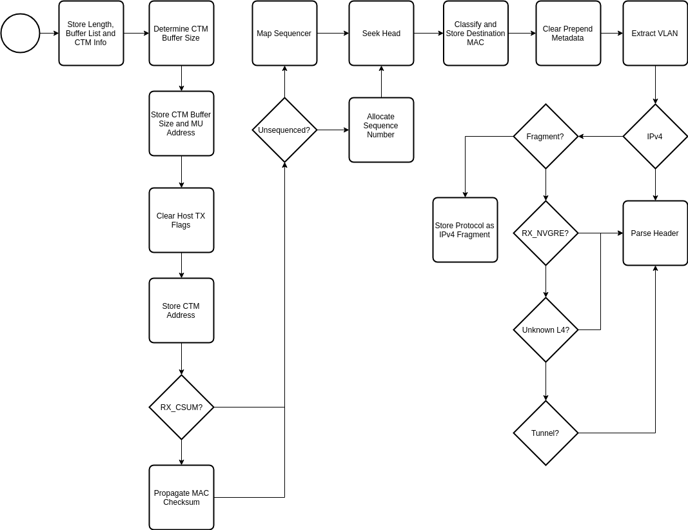

.. Copyright (c) 2018-2019 Netronome Systems, Inc. All rights reserved.
   SPDX-License-Identifier: BSD-2-Clause

Action - RX_WIRE
================

Description
-----------

Interface and Encoding
----------------------
.. rst-class:: action-encoding
    
    +------+-+-+-+-+-+-+-+-+-+-+-+-+-+-+-+-+-+-+-+-+-+-+-+-+-+-+-+-+-+-+-+-+
    |Bit / |3|3|2|2|2|2|2|2|2|2|2|2|1|1|1|1|1|1|1|1|1|1|0|0|0|0|0|0|0|0|0|0|
    |Word  |1|0|9|8|7|6|5|4|3|2|1|0|9|8|7|6|5|4|3|2|1|0|9|8|7|6|5|4|3|2|1|0|
    +======+=+=+=+=+=+=+=+=+=+=+=+=+=+=+=+=+=+=+=+=+=+=+=+=+=+=+=+=+=+=+=+=+
    |   0  |            <addr>           |P|  0  |VXLAN_NN_IDX |VXLAN|G|N|C|
    +------+-----------------------------+-+-----+---+-+-------+-----+-+-+-+

:VXLAN_NN_IDX: Next Neighbor base address of VXLAN port table
:VXLAN: Number of VXLAN ports
:G: Parse Geneve
:N: Parse NVGRE
:C: Propagate MAC checksum

.. |_| unicode:: 0xA0
    :trim:

Reads
.....

- PKT_META (packet engine pushed)

Writes
......

- PV_BLS
- PV_CBS
- PV_CTM_ISL
- PV_CTM_ADDR
- PV_CTM_ALLOCATED
- PV_HEADER_STACK
- PV_LENGTH
- PV_MAC_DST_TYPE
- PV_META_TYPES
- PV_MU_ADDR
- PV_NUMBER
- PV_OFFSET
- PV_PROTO
- PV_SPLIT
- PV_SEQ_CTX
- PV_SEQ_NO
- PV_SEEK_BASE
- PV_TX_HOST_FLAGS
- PV_VLAN_ID
- PV_QUEUE_IN

Implementation
--------------

API Dependencies
................

- __actions_next()
- __actions_read()
- __actions_restore_t_idx()
- bitfield_extract()
- move()
- ov_single()
- pkt_io_rx_wire()
- __pv_get_mac_dst_type()
- pv_hdr_parse()
- pv_init_nbi()
- fatal_error()
