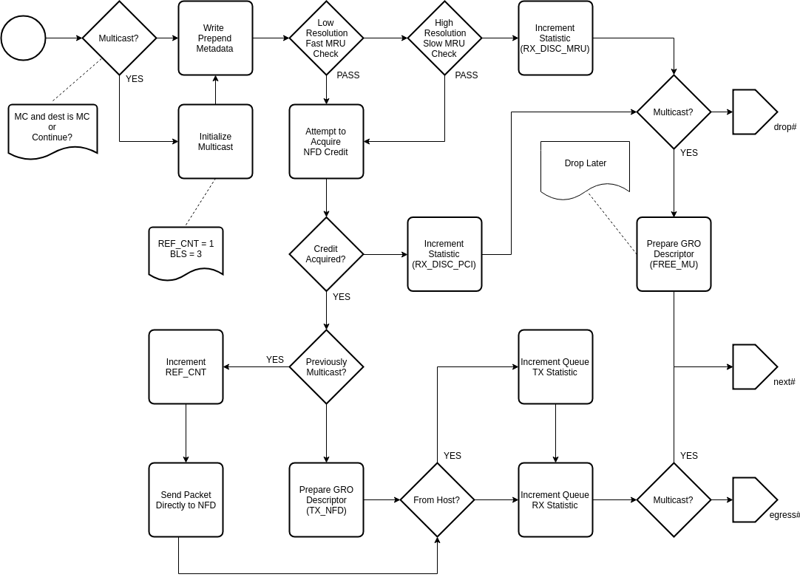

.. Copyright (c) 2018-2019 Netronome Systems, Inc. All rights reserved.
   SPDX-License-Identifier: BSD-2-Clause

Action - TX_HOST
================

Description
-----------

Interface and Encoding
----------------------
.. rst-class:: action-encoding
    
    +------+-+-+-+-+-+-+-+-+-+-+-+-+-+-+-+-+-+-+-+-+-+-+-+-+-+-+-+-+-+-+-+-+
    |Bit / |3|3|2|2|2|2|2|2|2|2|2|2|1|1|1|1|1|1|1|1|1|1|0|0|0|0|0|0|0|0|0|0|
    |Word  |1|0|9|8|7|6|5|4|3|2|1|0|9|8|7|6|5|4|3|2|1|0|9|8|7|6|5|4|3|2|1|0|
    +======+=+=+=+=+=+=+=+=+=+=+=+=+=+=+=+=+=+=+=+=+=+=+=+=+=+=+=+=+=+=+=+=+
    |   0  |            <addr>           |P|C|M|  MIN RXB  |PCI|Base Queue |
    +------+-----------------------------+-+-+-+-----------+---+-----------+

:C: Continue action processing after TX (non-terminal)
:M: Continue only if MAC destination is Multicast/Broadcast
:MIN_RXB: Minimum receive buffer size (as 8 byte multiple)
:PCI: Destination PCIe island
:Base |_| Queue: First queue of the VNIC (PV_QUEUE_OFFSET will be added)

.. |_| unicode:: 0xA0
    :trim:

Reads
.....

- fl_buf_sz_cache
- NFD_OUT_ATOMICS
- PV_BLS
- PV_CBS
- PV_CTM_ADDR
- PV_CTM_ALLOCATED
- PV_LENGTH
- PV_MAC_DST_MC
- PV_MU_ADDR
- PV_NUMBER
- PV_META
- PV_META_TYPES
- PV_OFFSET
- PV_QUEUE_IN
- PV_SPLIT
- PV_TX_FLAGS

Writes
......

- __pkt_io_gro_meta
- PKT_PREPEND
- PKT_MU_META
- PV_BLS
- nfd_out_atomics
- NIC_STATS_QUEUE_RX
- NIC_STATS_QUEUE_TX
- NIC_STATS_QUEUE_RX_DISCARD_PCI
- NFD_OUT_WQ

Implementation
--------------

API Dependencies
................

- __actions_next()
- __actions_read()
- __actions_restore_t_index()
- bitfield_extract()
- move()
- pkt_io_tx_host()
- pv_get_required_host_buf_sz()
- pv_get_gro_host_desc()
- pv_get_gro_mu_free_desc()
- pv_get_nfd_host_desc()
- pv_meta_write()
- pv_multicast_init()
- pv_multicast_resend()
- pv_stats_tx_host() 
- pv_stats_update()
- ov_single()

