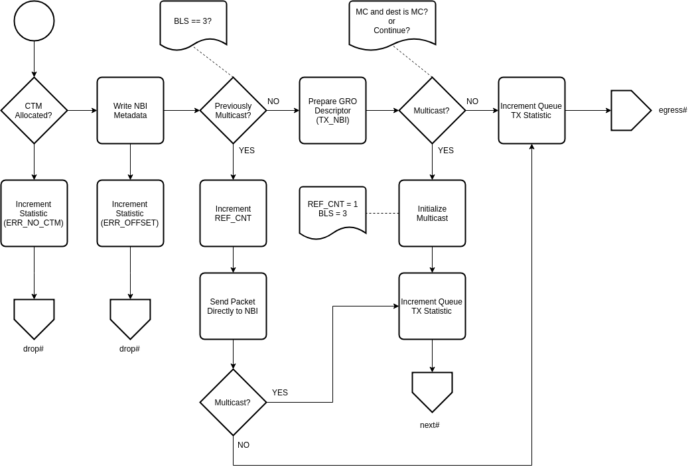

.. Copyright (c) 2018-2019 Netronome Systems, Inc. All rights reserved.
   SPDX-License-Identifier: BSD-2-Clause

Action - TX_WIRE
================

Description
-----------

Interface and Encoding
----------------------
.. rst-class:: action-encoding
    
    +------+-+-+-+-+-+-+-+-+-+-+-+-+-+-+-+-+-+-+-+-+-+-+-+-+-+-+-+-+-+-+-+-+
    |Bit / |3|3|2|2|2|2|2|2|2|2|2|2|1|1|1|1|1|1|1|1|1|1|0|0|0|0|0|0|0|0|0|0|
    |Word  |1|0|9|8|7|6|5|4|3|2|1|0|9|8|7|6|5|4|3|2|1|0|9|8|7|6|5|4|3|2|1|0|
    +======+=+=+=+=+=+=+=+=+=+=+=+=+=+=+=+=+=+=+=+=+=+=+=+=+=+=+=+=+=+=+=+=+
    |   0  |            <addr>           |P|C|M|  0  |N|     TM Queue      |
    +------+-----------------------------+-+-+-+-----+-+-------------------+

:C: Continue action processing after TX (non-terminal)
:M: Continue only if MAC destination is Multicast/Broadcast
:N: Destination NBI number
:TM |_| Queue: Traffic Manager queue number to enqueue the packet on

.. |_| unicode:: 0xA0
    :trim:

Reads
.....

- PV_BLS
- PV_CBS
- PV_CTM_ISL
- PV_CTM_ADDR
- PV_MAC_DST_MC
- PV_MU_ADDR
- PV_NUMBER
- PV_OFFSET
- PV_QUEUE_IN

Writes
......

- PKT_CTM_META
- PKT_MU_META
- PKT_PREPEND
- PV_BLS
- NIC_STATS_QUEUE_TX
- NIC_STATS_QUEUE_TX_ERROR_NO_CTM
- NIC_STATS_QUEUE_TX_ERROR_OFFSET

Implementation
--------------

API Dependencies
................

- __actions_next()
- __actions_read()
- __actions_restore_t_idx()
- pkt_io_tx_write()
- pv_multicast_init()
- pv_multicast_resend()
- pv_get_gro_wire_desc()
- pv_setup_packet_ready()
- pv_stats_tx_wire()
- pv_stats_update()
- pv_write_nbi_meta()
