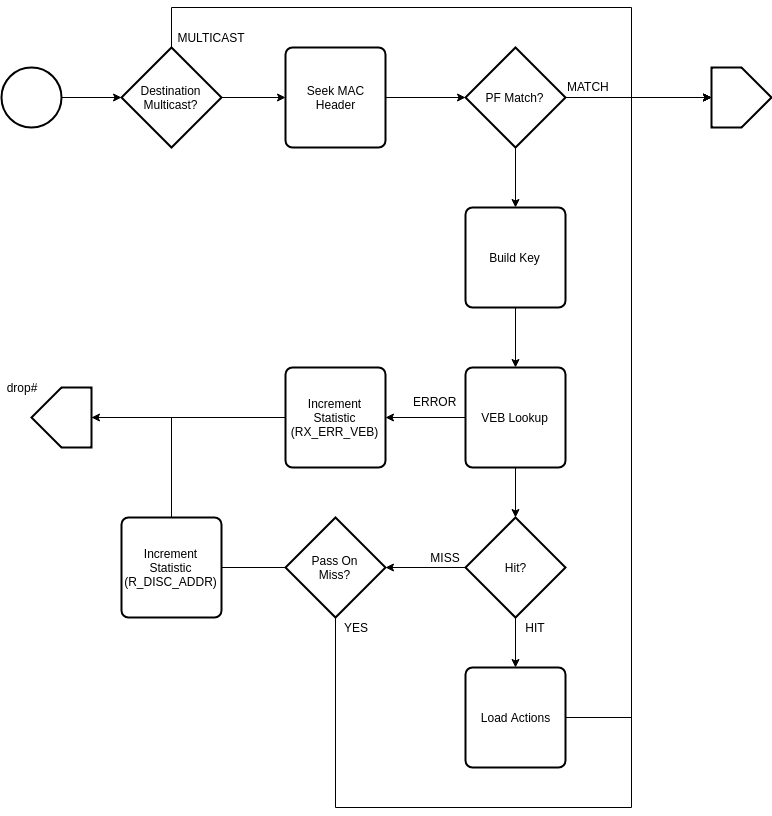

.. Copyright (c) 2018-2019 Netronome Systems, Inc. All rights reserved.
   SPDX-License-Identifier: BSD-2-Clause

Action - VEB_LOOKUP 
===================

Description
-----------

Interface and Encoding
----------------------
.. rst-class:: action-encoding
    
    +------+-+-+-+-+-+-+-+-+-+-+-+-+-+-+-+-+-+-+-+-+-+-+-+-+-+-+-+-+-+-+-+-+
    |Bit / |3|3|3|2|2|2|2|2|2|2|2|2|2|1|1|1|1|1|1|1|1|1|1|0|0|0|0|0|0|0|0|0|
    |Word  |1|0|9|8|7|6|5|4|3|2|1|0|9|8|7|6|5|4|3|2|1|0|9|8|7|6|5|4|3|2|1|0|
    +======+=+=+=+=+=+=+=+=+=+=+=+=+=+=+=+=+=+=+=+=+=+=+=+=+=+=+=+=+=+=+=+=+
    |   0  |            <addr>           |P|            MAC HI             |
    +------+-----------------------------+-+-------------------------------+
    |                                   MAC LO                             |
    +----------------------------------------------------------------------+

:MAC: Pass packet on match (skip lookup / shortcut to PF)
:MAC = 0: Pass on VEB miss (promiscous mode)

Reads
.....

- PKT_DATA
- PV_MAC_DST_MC
- PV_VLAN_ID

Writes
......

- NIC_STATS_QUEUE_RX_ERROR_VEB
- NIC_STATS_QUEUE_RX_DISCARD_ADDR

Implementation
--------------

API Dependencies
................

- __actions_next()
- __actions_read()
- __actions_read_begin()
- __actions_read_end()
- __actions_restore_t_idx()
- bitfield_extract()
- hashmap_ops()
- ov_start()
- ov_set_use()
- ov_clean()
- pv_invalidate_cache()
- pv_seek()
- pv_stats_update()

