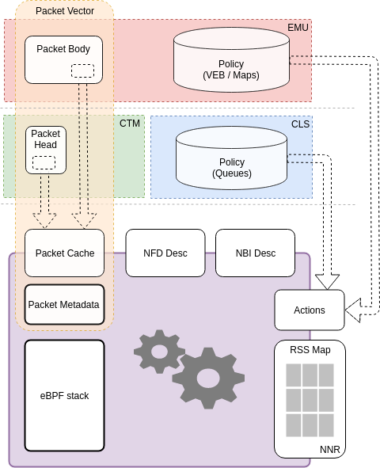

.. Copyright (c) 2018-2019 Netronome Systems, Inc. All rights reserved.
   SPDX-License-Identifier: BSD-2-Clause

Data Structures
===============

Worker Memories
---------------

Packet Vector
-------------
.. rst-class:: action-encoding
    
    +-------+-+-+-+-+-+-+-+-+-+-+-+-+-+-+-+-+-+-+-+-+-+-+-+-+-+-+-+-+-+-+-+-+
    | Bit / |3|3|2|2|2|2|2|2|2|2|2|2|1|1|1|1|1|1|1|1|1|1|0|0|0|0|0|0|0|0|0|0|
    | Word  |1|0|9|8|7|6|5|4|3|2|1|0|9|8|7|6|5|4|3|2|1|0|9|8|7|6|5|4|3|2|1|0|
    +=======+=+=+=+=+=+=+=+=+=+=+=+=+=+=+=+=+=+=+=+=+=+=+=+=+=+=+=+=+=+=+=+=+
    |       |                                                               |
    |       |                       Prepend Metadata                        |
    |  0-7  |                                                               |
    |       |                                   +---------------------------+
    |       |                                   | Original Pkt Length (PCI) |
    +-------+-----------+-------------------+---+---------------------------+
    |    8  |  CTM ISL  |   Packet Number   |BLS|       Packet Length       |
    +-------+-+---+-----+-------------------+---+---------------------------+
    |    9  |S|CBS|           MU Buffer Address [39:11]                     |
    +-------+-+---+-----+-------------------+-----+-------------------------+
    |    10 |A|    0    |   Packet Number   |  0  |         Offset          |
    +-------+-+---------+-------------------+-----+---------+---------------+
    |    11 |        Sequence Number        | --- | Seq Ctx |   Protocol    |
    +-------+-------------------------------+-+-+-+---------+---+-+-+-+-+-+-+
    |    12 |         TX Host Flags         |M|B|Seek (64B algn)|-|Q|I|i|C|c|
    +-------+-------------------------------+-+-+---------------+-+-+-+-+-+-+
    |    13 |       8B Header Offsets (stacked outermost to innermost)      |
    +-------+-----------------+-----+-----------------------+---------------+
    |    14 |  Ingress Queue  | LMP |        VLAN ID        | Queue Offset  |
    +-------+-----------------+-----+-----------------------+---------------+
    |    15 |                      Metadata Type Fields                     |
    +-------+---------------------------------------------------------------+

