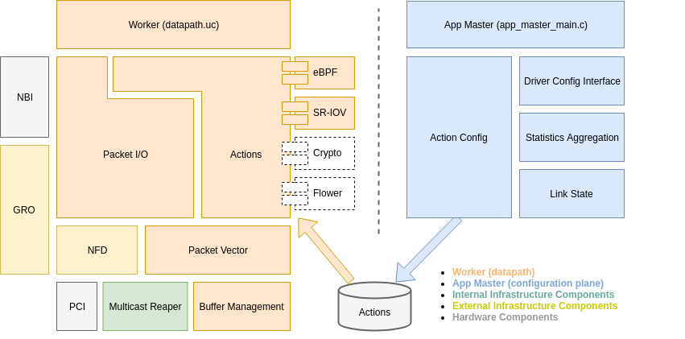

.. Copyright (c) 2018-2019, Netronome Systems, Inc. All rights reserved.
   SPDX-License-Identifier: BSD-2-Clause
   CoreNIC Architecture documentation master file, created by
   sphinx-quickstart on Tue Nov 20 17:41:47 2018.
   You can adapt this file completely to your liking, but it should at least
   contain the root `toctree` directive.

CoreNIC Design 
==============

.. toctree::
   :maxdepth: 2
   :caption: Contents:
   :glob:

   actions/*
   pkt_io/*
   data_structures/*

Indices and tables
==================

* :ref:`genindex`
* :ref:`modindex`
* :ref:`search`
