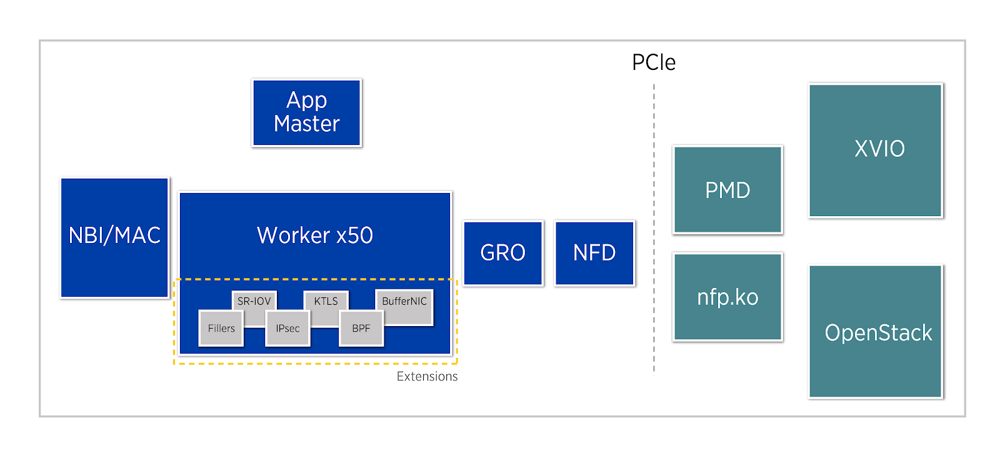

.. Copyright (c) 2018 Netronome Systems, Inc. All rights reserved.
   SPDX-License-Identifier: BSD-2-Clause.

The Agilio SmartNIC Architecture
===================================

   The conceptual architecture of the Agilio SmartNIC

The Agilio CX SmartNICs are based on the NFP-4000 and are available in low
profile PCIe and OCM v2 NIC form factors suitable for use in COTS servers.
This is a 60 core processor with eight cooperatively multithreaded threads per
core. The flow processing cores have an instruction set that is optimized for
networking. This ensures an unrivalled level of flexibility within the data
plane while maintaining performance. The OVS datapath can also be enabled
without a server reboot.

Further extensions such as BPF offload, SR-IOV or custom offloads can be added
without any hardware modifications or even server reboot. These extensions are
not covered by this guide, which deals with the basic and OVS-TC offload
firmware only.

The basic firmware offers a wide variety of features including RSS (Receive
Side Scaling), Checksum Offload (IPv4/IPv6,TCP,UDP,Tx/Rx), LSO (Large
Segmentation Offload), IEEE 802.3ad, Link flow control, 802.1AX Link
Aggregation, etc. For more details regarding currently supported features
refer to the section
:ref:`06_Basic_firmware_features:Basic Firmware Features`.
